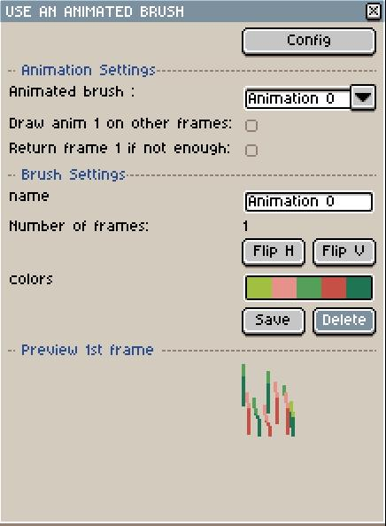

# Animated Brush Extension

This is an animated brush extension for Aseprite. With it you can copy through multiple frame and use it as brush with some useful features.

## Features

* Add and save new custom animated brushes
* The animated brushes are saved between sessions
* Name the animated brush
* Use an animated brush (paint on several frames at once)
* Flip horizontally / vertically the animated brush
* Change each color from the brush separately
* Preview 1st frame
* Option to draw the first frame from the animation on all frames from layer that doesn't contain the animation.
* If there is not enough frames left to draw the animation, option to return frame 1 to draw remaining.
* Import / Export animated brushes. Option to reset brushes when exporting. **Warning: This feature is meant for a personal usage, import animated brushes from other sources at your own risks**

## Usage

To add a new animated brush :
* Select the zone on the sprite contianing the animation
* Select the cells containing the animation
* Edit -> New animated brush (shortkey Space+K)
* Valid after potentially changing the name

To use an animated brush: Edit -> Use animated brush (shortkey space+L).

    

Once the dialog box is activated, you can directly use the animated brush.

Animation settings:
* You can select another animation in the animated brush select
* The checkbox "Draw anim 1 on other frames" draw the first frame from the animation on all other frames from the layer. By default only the animation is drawn.
* The checkbox "Return frame 1 if not enough" make it that if there is not enough frames left to draw the complete animation, it will loop back to the beginning to draw the rest. By default, if there is not enough frames left it shows an error message.

Brush settings :
* You can change the name of the animated brush
* Flip H or Flip V flips horizontally or vertically the complete animation (shortkey space + H or V).
* Colors let you pick or change the colors present in the animation. Left click pick, right click change to the current foreground color. The color will be replaced in the whole animation.
* Save let you save the previous modifications for later use. If you don't save, all modifications are temporary.
* Delete let you delete the animated brush.

Preview shows the first frame from the animation.

Config open a menu in which you can export or import animated brushes as json files. If "Reset local data when export" is checked, all brushes will be deleted from current data after an export is done.

When importing a json file, if an animated brush has the same name than an already existing one, it is ignored.

**Warning: This feature is meant for a personal usage, import animated brushes from other sources at your own risks**

## Author

This extension is developped by [Fabico](https://mastodon.social/@fabico).

## License

This extension is released under the terms of the MIT license.
Read LICENSE.txt for more information.

## Notes

* If there is not enough frames or drawing is impossible, a message will be displayed. However the current custom brush will be drawn anyway. This is a known problem without workaround for the time being, remember to ctrl+z to undo it !
* It is planned to add a feature to use the animated brush only on some tags
* The preview may sometimes show additionnal colors, idk why for the time being (probably a color mode problem)